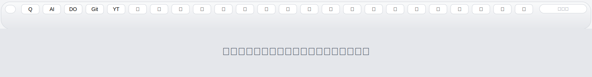
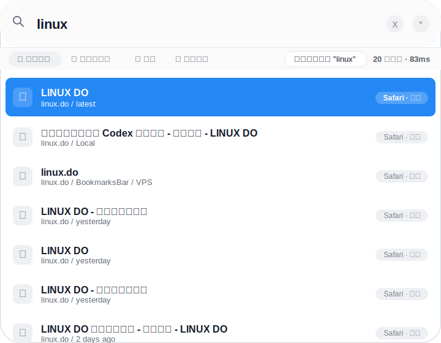

# QuickTab


**Search and switch browser tabs, bookmarks, and history like Spotlight.**

[中文 README](./README.md) · [Download](#download) · [Quick Start](#quick-start) · [Browser Connection](#browser-connection) · [Development](#development) · [Privacy](#privacy)

---

## Why QuickTab

When too many browser tabs are open, tab titles disappear and finding the right page turns into icon scanning.



QuickTab collects open tabs, bookmarks, and history from multiple browsers into one local search window. Open it, type a keyword, and press Enter to jump back to an existing tab; bookmark, history, and URL results open in your configured default browser.



## Features

- Global shortcut for fast browser page switching.
- Collect open tabs, bookmarks, and history from multiple browsers into one search box.
- Prioritizes already-open pages to reduce duplicate tabs.
- Opens bookmark, history, and URL results in your default browser.
- Supports Chrome and Microsoft Edge; Safari is supported on macOS.
- Searches Chinese titles, pinyin, domains, URLs, and bookmark folders.
- Filters results by all sources, tabs, bookmarks, or history.
- Bilingual UI, launch at login, tray/menu bar entry, and custom shortcuts.
- Local-only index. Browser data is not uploaded.

## Platform Support

| Platform | Status | Notes |
| --- | --- | --- |
| macOS Apple Silicon | Supported | `.dmg` and `.zip` builds |
| Windows x64 | Supported | `.exe` installer |
| Chrome | Supported | Connected through browser extension |
| Microsoft Edge | Supported | Connected through browser extension |
| Safari | Supported | macOS only |

## Download

Download the latest version from GitHub Releases:

[Download QuickTab](https://github.com/zhangsiqiang519/QuickTab/releases/latest)

Release builds usually include:

| System | File |
| --- | --- |
| macOS | `QuickTab-<version>-arm64.dmg` |
| macOS | `QuickTab-<version>-arm64-mac.zip` |
| Windows | `QuickTab-<version>-x64.exe` |

## Quick Start

### macOS

1. Download `QuickTab-<version>-arm64.dmg`.
2. Open the DMG and drag `QuickTab.app` into `Applications`.
3. Launch QuickTab.
4. If macOS blocks the app, allow it from `System Settings > Privacy & Security`.

### Windows

1. Download `QuickTab-<version>-x64.exe`.
2. Run the installer.
3. Launch QuickTab.
4. Follow the first-run setup guide to connect Chrome or Edge.

## Browser Connection

QuickTab uses a native bridge and browser extension to read Chrome / Edge tabs, bookmarks, and history, then keeps those browser sources searchable in one local index. During first-run setup, QuickTab opens the browser extension page and shows the bundled extension folder.

### Chrome

1. Open `chrome://extensions`.
2. Enable `Developer mode`.
3. Click `Load unpacked`.
4. Go back to QuickTab and click `Prepare Chrome extension`.
5. Select the extension folder shown by QuickTab.
6. If the extension does not connect immediately, restart Chrome and QuickTab.

### Microsoft Edge

1. Open `edge://extensions`.
2. Enable `Developer mode`.
3. Click `Load unpacked`.
4. Go back to QuickTab and click `Prepare Edge extension`.
5. Select the extension folder shown by QuickTab.
6. If the extension does not connect immediately, restart Edge and QuickTab.

### Safari

Safari is macOS-only and does not use the Chrome / Edge extension.

Switching open Safari tabs requires Automation permission:

1. Open `System Settings > Privacy & Security > Automation`.
2. Allow QuickTab to control Safari.

Importing Safari bookmarks requires Full Disk Access:

1. Open `System Settings > Privacy & Security > Full Disk Access`.
2. Add and enable QuickTab.
3. Restart QuickTab.
4. Open QuickTab Settings and click `Import Safari`.

## Usage

| System | Default shortcut |
| --- | --- |
| macOS | `Alt+Space` |
| Windows | `Ctrl+Shift+K` |

Common keyboard controls:

| Key | Action |
| --- | --- |
| `Enter` | Open or switch to the selected result |
| `↑ / ↓` | Move selection |
| `Esc` | Hide QuickTab |
| `Ctrl+,` / `Command+,` | Open Settings |

If there is no matching result, QuickTab opens or searches your input with the system default browser.

For search results, QuickTab first switches to an already-open tab when possible. Bookmark, history, and URL results open in the default browser configured in QuickTab, with the system default browser as fallback.

## Development

```bash
npm install
npm run dev:electron
```

Common commands:

```bash
npm run typecheck
npm test
npm run build
npm run dist
```

`release/`, `dist/`, `.workflow/`, and local agent state files are ignored. Use GitHub Releases for installers instead of committing local build artifacts.

## Privacy

QuickTab keeps its search index on your computer for local search and tab switching. It does not provide server-side sync and does not upload browser tabs, bookmarks, or history to a remote service.

## License

This project is licensed under the [MIT License](./LICENSE).
